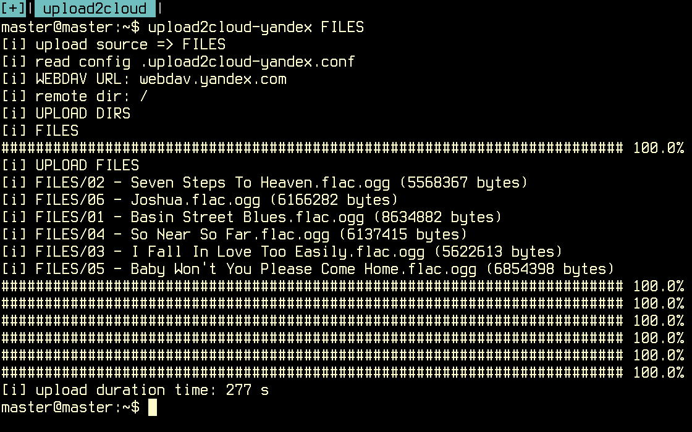

# upload2cloud - cloud disk uploader   

+ easy way upload files to cloud storages from command line / *nix shell, without GUI
+ simple webdav linux terminal client 
+ universal & suitable for any webdav storage
+ just one file, 5K only
+ ideal for automate, customize and modificate
+ [upload2cloud](https://github.com/hyphop/upload2cloud/blob/master/src/upload2cloud) is free & opensource

# Checked & Tested Storage Provides

we check webdav providers from this list  https://www.free-online-backup-services.com/features/webdav 

PROVIDER | FREE | WEBDAV SERVER | Checked | Comments 
--- | --- | --- | --- | -- |
[yandex](https://disk.yandex.com)	| 10 GB	| webdav.yandex.com | ok | Best
[4shared](https://4shared.com)	| 10 GB	| webdav.4shared.com | ok | have Ad 
[Box](https://box.com) | 10 GB	| dav.box.com/dav | ok | poor web ui
[CloudMe](https://cloudme.com)	| 3 GB	| webdav.cloudme.com | dont work | have some not standart webdav specifics 
[DriveOnWeb](https://driveonweb.de)	| 5GB | storage.driveonweb.de/probdav | not tested |

<!--
DriveHQ*	1 GB	
IDrive Sync	5 GB	dav.idrivesync.com
Koofr	2 GB	https://app.koofr.net/dav
Memopal	3 GB	https://dav.memopal.com/
PowerFolder Free	5 GB	my.powerfolder.com/webdav
Safecopy Backup	3 GB	dav.safecopybackup.com
Storage Made Easy (US)	5 GB	webdav.storagemadeeasy.com
Storage Made Easy (EU)	5 GB	webdaveu.storagemadeeasy.com
Strato HiDrive Free	5 GB	https://webdav.hidrive.strato.com
-->

you can check another storage providers , 
make some customization and fork [upload2cloud](https://github.com/hyphop/upload2cloud)

# Usage 
    
    upload2cloud [ DIRS | FILES ]
    
# Get Source 

    git clone https://github.com/hyphop/upload2cloud

# Get && Install

just one line get && install

    wget https://raw.githubusercontent.com/hyphop/upload2cloud/master/dl/upload2cloud && chmod 0777 upload2*

# Custom providers install

just make symlinks `upload2cloud-YOUR_SERVICE_NAME` to `upload2cloud` as below

    ln -s upload2cloud upload2cloud-yandex
    ln -s upload2cloud upload2cloud-4shared
    ln -s upload2cloud upload2cloud-box.com
    ...
    ln -s upload2cloud upload2cloud-YOUR_SERVICE_NAME

## Yandex Disk

    wget -O upload2cloud-yandex https://raw.githubusercontent.com/hyphop/upload2cloud/master/src/upload2cloud && chmod 0777 upload2*

## 4shared.com

    wget -O upload2cloud-4shared https://raw.githubusercontent.com/hyphop/upload2cloud/master/src/upload2cloud && chmod 0777 upload2*

## Box.com

    wget -O upload2cloud-box.com https://raw.githubusercontent.com/hyphop/upload2cloud/master/src/upload2cloud && chmod 0777 upload2*

# Just another way to install

    curl -kL https://git.io/vpjKe > upload2cloud

# Author 

    ## hyphop ##

